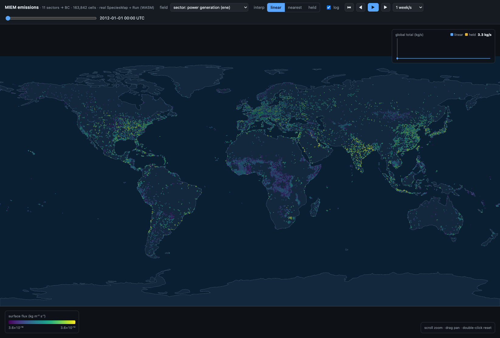

# MIEM emissions visualizer

A small, local, browser-based map viewer for the emissions MIEM reads and
produces. It animates the surface flux on a world map at any time resolution and
lets you toggle between raw inventory sectors and MIEM's `SpeciesMap` outputs —
**each frame computed in the browser by the real `miem::Emissions::Run`
pipeline, compiled to WebAssembly** (the genuine `EmissionsBuilder`, `SpeciesMap`,
`TemporalInterpolator`, and HEMCO aggregation — not a JS re-implementation).

> **This is an orphan branch.** It is intentionally disconnected from `main` and
> is **not** meant to be merged. It is scratch/diagnostic tooling and changes
> nothing about MIEM's build, install, or public surface — the driver links the
> prebuilt `libmiem.a` and the WASM module compiles MIEM's netCDF-free sources
> unchanged. The MIEM source itself does not live on this branch; the build
> reaches into the surrounding MIEM checkout for it (see *Prerequisites*).



## What you can do

- **Map** the per-cell surface flux for the whole globe, on the MPAS mesh, with
  zoom/pan and a log color scale. The legend **auto-rescales to each field**, so
  a small sector isn't crushed to the floor of the all-sectors scale.
- **Pick a field**: any individual inventory sector (each a distinct geography —
  shipping lanes, power-plant point sources, residential/population…), or a MIEM
  `SpeciesMap` output: `Σ all sectors` (the many→one aggregation) or a `0.8·Σ` /
  `0.2·Σ` mass split. All produced live by the real `SpeciesMap::Apply`.
- **Play through time** hourly (or step ±1 h, scrub, change speed) and watch the
  real `TemporalInterpolation` modes — `linear` / `nearest` / `held` — applied
  per frame. A sparkline tracks the area-weighted global total over the year.

## Two renderers (same data, same in-browser MIEM)

- **`index.html` — equirectangular pixels.** A Canvas2D world map, one dot per
  cell (point splat). Runs in any browser; the original view, with the year-long
  global-total sparkline.
- **`cells.html` — actual cells (WebGPU).** Renders the **true MPAS Voronoi cell
  polygons** — gap-free and area-true — via a WGSL shader pair, with a **view
  toggle**: a rotatable **globe** or a 2D **equirectangular map**. The cell
  geometry is reconstructed once from the cell centers (`make_mesh_geometry.py`:
  an MPAS mesh is the spherical Voronoi tessellation of its generators) and
  uploaded to the GPU; each frame only the per-cell flux is pushed to a storage
  buffer and the shader colors every polygon (`values[cellIndex]` → log →
  viridis). A lat/lon graticule aids orientation in both views. Drag to
  rotate/pan, scroll to zoom, double-click to reset. Needs a WebGPU browser
  (Chrome/Edge, Safari 18+, recent Firefox); otherwise it links back to the
  pixel view.

The two pages cross-link in the header and share the same field/interp controls.
On the 2D map the antimeridian seam is handled by unwrapping each cell's vertices
about its own center longitude (built into the geometry), and east/west wrap is
filled by drawing the map three times with a ±360° longitude offset.

## Prerequisites

This tool is meant to live as a branch/worktree **inside a MIEM checkout**, because
the build compiles against MIEM's source:

- A configured MIEM build providing `build/src/libmiem.a`, plus MIEM's `include/`
  and `src/` (the script builds the `miem` target if the library is missing).
  The build locates this automatically via `git rev-parse --git-common-dir`, so
  it works from a worktree of the MIEM repo without any source on this branch.
- A C++20 compiler and `nc-config` on `PATH` (Homebrew/conda netCDF) for the
  offline driver.
- **emscripten** (`emcc`) for the in-browser pipeline — `brew install emscripten`.
- Python with `zarr>=3`, `netCDF4`, `numpy`, and `scipy` (the Voronoi cell
  geometry). `zarr>=3` needs Python ≥3.11; the script builds `viz/.venv` from a
  3.11+ interpreter if the active one can't satisfy the stack.
- For the **actual-cells globe** (`cells.html`): a WebGPU-capable browser. No
  extra install beyond the browser.

## The data file (you supply it)

The viewer needs a **local UPTEMPO on-mesh emission file** — a netCDF with
`(Time, nCells)` sector variables and an `xtime` timestamp variable, already
remapped onto an MPAS mesh (this is what the `uptempo` reader convention consumes).
The default points at the black-carbon example:

```
CAMS-GLOB-ANT_2012_MPAS.x1.163842.grid.bc_c20260508.nc   (Time=12, nCells=163842)
```

On-mesh files carry **no coordinates**, so a one-time MPAS mesh lookup supplies
`latCell`/`lonCell` for the map; the cached result (`viz/data/mesh_coords.npz`)
ships with this branch so a first run needs no 100 MB mesh download for the
standard `x1.163842` grid.

## Quick start

```sh
./viz/build_and_run.sh          # build driver + WASM + Zarr store + cell geometry, serve on :8000
# open http://localhost:8000/           (equirectangular pixels)
#   or  http://localhost:8000/cells.html  (WebGPU actual cells: globe or 2D map)
./viz/build_and_run.sh serve    # just re-serve an already-built store
```

Override the input via env: `INPUT`, `VAR`, `SPECIES`, `MESH`, `PORT`.

## Pointing it at other data

Sectors are auto-discovered (any `(Time, nCells)` float variable, minus the
precomputed `*_sum`), and the field labels key off the bare CAMS sector code, so
other species work too (`co_anth_ene`, `nox_anth_ene`, … all label as their
sector):

```sh
INPUT=/path/to/other_on_mesh.nc VAR=co_anth_sum SPECIES=CO ./viz/build_and_run.sh
```

If the new file is on a **different mesh**, delete `viz/data/mesh_coords.npz` and
set `MESH=/path/to/that.grid.nc` (or let the script download the standard
`x1.163842`). The mesh's `nCells` ordering must match the inventory.

> Loading non-BC / non-`x1.163842` files is supported by construction but
> **untested** — there is no alternative sample data yet. Treat it as best-effort.

## Internals

`viz/README.md` documents how the full MIEM pipeline runs in the browser (the
netCDF-isolation seam, the in-memory reader, the WASM bridge), why a separate
mesh is needed, and the role of each file.
